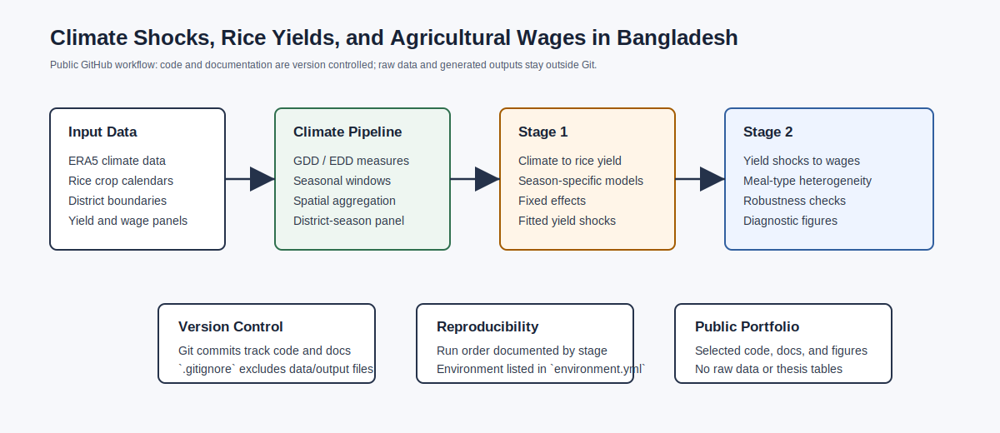
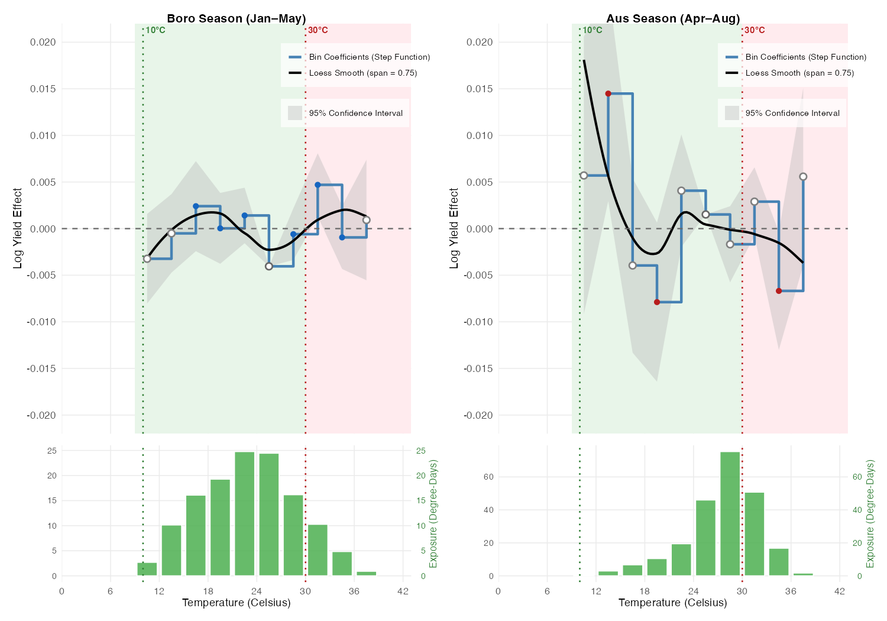
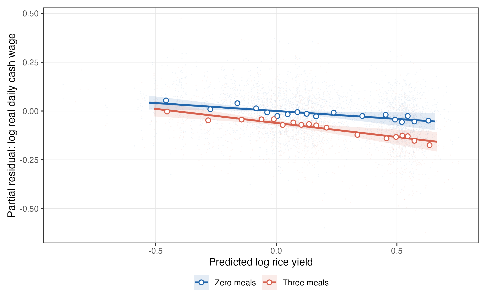

# Climate Shocks, Rice Yields, and Agricultural Wages in Bangladesh

This repository contains a reproducible research pipeline for studying how climate-driven rice yield shocks pass through to agricultural wages in Bangladesh. The project combines gridded climate data, crop calendars, district-level rice yields, and agricultural wage records to estimate whether yield risk is borne differently by casual and attached farm workers.

## Research Question

Do climate-induced rice yield shocks affect agricultural wages in Bangladesh, and does pass-through differ by labor-contract type?

The analysis focuses on Bangladesh's three major rice seasons:

- **Boro**: irrigated dry-season rice
- **Aus**: early monsoon rice
- **Aman**: main monsoon rice

The empirical design first estimates season-specific climate-to-yield relationships, then uses fitted yield shocks to study wage responses by meal-provision category, a proxy for labor attachment. The current canonical specification uses levels with high-dimensional fixed effects; first-difference variants are retained as robustness checks.

## Why This Project Fits an Agricultural Economics / Remote Sensing Portfolio

This project demonstrates:

- Applied agricultural economics with policy-relevant labor-market outcomes
- Climate-risk measurement using gridded weather data and crop calendars
- Reproducible R and Python workflows
- Spatial aggregation from gridded data to administrative units
- Fixed-effects econometric models, robustness checks, and diagnostic scripts
- Version-control-ready code organization for collaborative research

## Repository Structure

```text
.
├── code/
│   ├── pipeline/   # Python pipeline: ERA5 climate data -> district-season exposure
│   ├── stage1/     # R scripts: climate -> rice yield regressions
│   ├── stage2/     # R scripts: yield shock -> wage pass-through regressions
│   └── utils/      # Shared district-name harmonization helpers
├── data/
│   └── README.md   # Data access and licensing notes
├── docs/           # Method notes and project documentation
├── examples/       # Small real-data extracts from processed outputs
├── figures/        # Placeholder for public-facing selected figures
├── environment.yml # Conda/R environment specification
├── LICENSE
└── README.md
```

## Selected Figures

The repository includes a small number of public-facing visuals in `figures/selected/`.







See `docs/VISUAL_GALLERY.md` for figure notes.

## Example Data Products

The repository includes small real-data extracts in `examples/`. These are limited documentation samples, not a full replication dataset or complete result-table release.

| Example file | Purpose |
|---|---|
| `examples/sample_climate_exposure.csv` | District-season growing degree days, extreme degree days, and precipitation |
| `examples/sample_rice_yield_panel.csv` | District-season rice yield panel structure |
| `examples/sample_wage_panel.csv` | Agricultural wage panel fields by season and meal category |
| `examples/sample_analysis_panel.csv` | Merged yield-shock and wage analysis panel fields |
| `examples/sample_contract_slope_diagnostic.csv` | Compact wage-yield contract-slope diagnostic |

See `docs/SAMPLE_TABLES.md` for a readable version.

## Workflow

### 1. Climate Exposure Pipeline

Scripts in `code/pipeline/` process gridded climate data into district-season rice exposure measures:

1. Download and prepare ERA5 hourly climate data
2. Construct growing degree days and extreme degree days
3. Apply rice crop calendars for Boro, Aus, and Aman seasons
4. Spatially aggregate gridded exposure to Bangladeshi districts
5. Merge climate exposure with rice yield panels

### 2. Stage 1: Climate to Rice Yields

Scripts in `code/stage1/` estimate the relationship between seasonal climate exposure and rice yields. The current canonical specification uses season-specific panel fixed effects, with first-difference variants retained as robustness checks.

### 3. Stage 2: Rice Yield Shocks to Wages

Scripts in `code/stage2/` estimate whether fitted yield shocks affect agricultural wages. The main specification models log real wages using fitted log yield, year fixed effects, district-by-growing-season fixed effects, and district-clustered standard errors. The key heterogeneity is by meal-provision category, which is used as a proxy for worker attachment and contract type.

## Core Methods

- Spatial climate aggregation
- Crop-calendar-weighted exposure construction
- Growing degree days and extreme degree days
- Fixed-effects panel regressions
- Levels specifications with high-dimensional fixed effects
- First-difference robustness checks
- Cluster-robust and robustness inference
- Heterogeneity analysis by season, worker type, and district characteristics

## Data

Raw data are not included in this repository. Several inputs are large, licensed, or obtained from external providers. See `data/README.md` for data sources and reproducibility notes.

## Installation

Create the project environment:

```bash
conda env create -f environment.yml
conda activate bangladesh-climate-wage
```

Install any additional R packages that are not available through your Conda setup from within R:

```r
install.packages(c("fixest", "modelsummary", "tidyverse", "sf", "terra"))
```

## Reproducibility Status

This is a public portfolio version of an active research project. The code structure and scripts are provided for transparency and review. Full reproduction requires access to the original climate, yield, wage, crop-calendar, and geospatial data sources.

See `docs/REPRODUCIBILITY.md` for the version-control and reproducibility workflow.

## Citation

If you use or adapt this code, please cite:

> Tahmid, M. T. (2026). Climate Shocks, Rice Yields, and Agricultural Wages in Bangladesh. Research code repository.

## Author

Muhammad Taky Tahmid  
Ph.D. candidate, University of Delaware  
Research areas: agricultural economics, climate impacts, food security, geospatial data science
